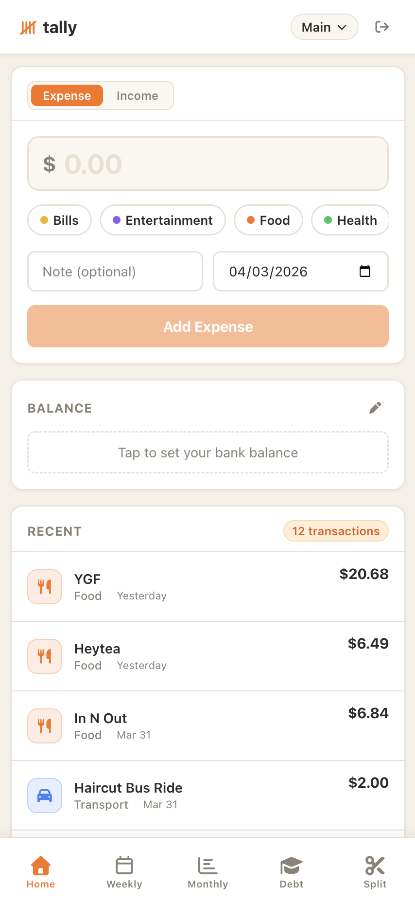
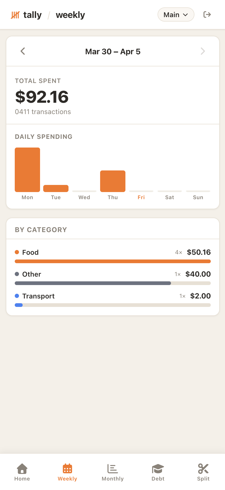
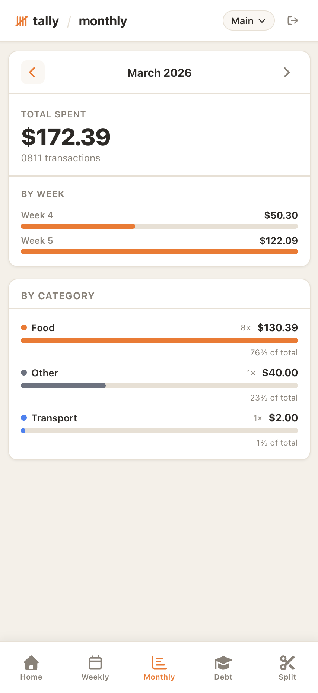
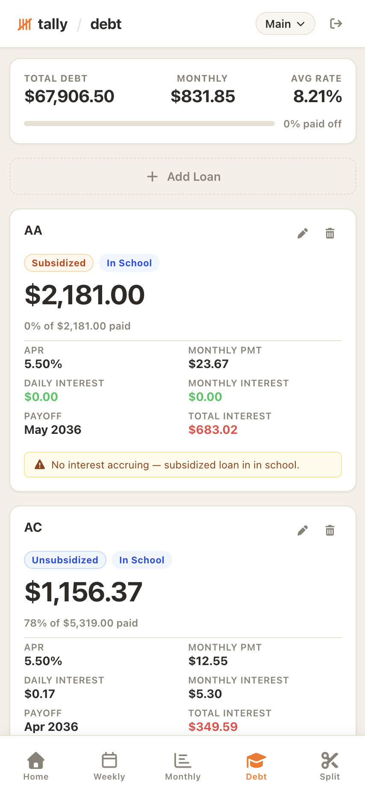
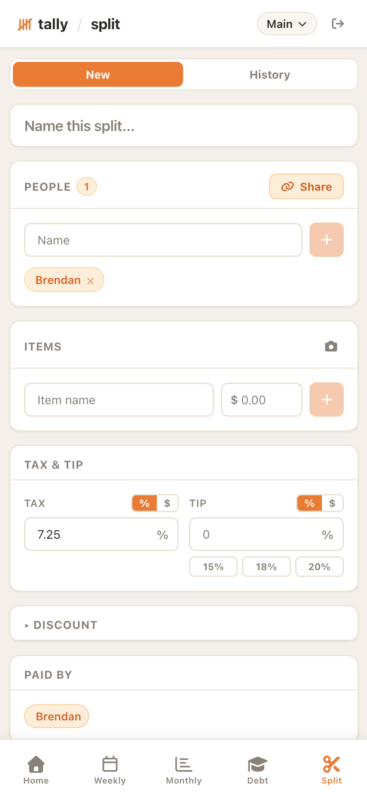

<div align="center">

#  tally

**I refused to pay $10/month for a budgeting app. Now I pay $10/month to host my own server and my spending habits aren't fixed.**

Built for personal use after realizing every finance app wants a subscription, your bank login, and your firstborn. Single-user and self-hosted — tracks expenses, loans, and splits bills because apparently I needed to rebuild Mint from scratch.

<br/>

[](https://react.dev)
[](https://vitejs.dev)
[](https://nodejs.org)
[](https://postgresql.org)

</div>

---

## What's in it

**Expenses** — log income and spending with categories, descriptions, and dates across multiple accounts. Inline editing so you can fix a typo without hunting through menus.

**Accounts** — keep checking, savings, or whatever else separated. Each one tracks its own balance, persisted locally so it survives a page refresh.

**Weekly & Monthly Breakdowns** — see where the money actually went. Weekly view shows spending by day and category; monthly view breaks it down by week. Useful for noticing that you spent $200 on coffee again.

**Debt Tracker** — manage student loans and personal loans with interest rates, payoff projections, and status tracking (in school, grace period, repayment, and so on). Does the math so you don't have to.

**Bill Splitter** — divide a restaurant bill among people with itemized entries, tax, tip, and discounts. Generates a shareable link so everyone can see their share without logging in. Supports Venmo and Zelle payment info.

**Receipt Scanning** — photograph a receipt and let AI pull out the line items automatically. Saves the manual entry step when splitting a complicated bill.

**Works as a phone app** — open the site in Safari on your iPhone, tap the share button, and choose "Add to Home Screen". Runs full screen with its own icon.

---

## Preview

<details>
<summary><strong>Expenses & Accounts</strong></summary>
<br/>
<p align="center">
  
</p>
</details>

<details>
<summary><strong>Weekly Breakdown</strong></summary>
<br/>
<p align="center">
  
</p>
</details>

<details>
<summary><strong>Monthly Breakdown</strong></summary>
<br/>
<p align="center">
  
</p>
</details>

<details>
<summary><strong>Debt Tracker</strong></summary>
<br/>
<p align="center">
  
</p>
</details>

<details>
<summary><strong>Bill Splitter</strong></summary>
<br/>
<p align="center">
  
</p>
</details>

---

## Running locally

### Prerequisites
- Node.js 16+
- PostgreSQL (optional — uses in-memory storage if no database URL is set)

### Setup

```bash
# 1. Install dependencies
npm install

# 2. Create local database (skip if using a hosted DB or in-memory mode)
createdb tally

# 3. Configure environment
cp .env.example .env   # then fill in your values
```

<details>
<summary><strong>.env reference</strong></summary>

```env
# Database — leave empty to use in-memory storage (data resets on restart)
DATABASE_URL=postgresql://localhost/tally

# Auth credentials
APP_USERNAME=your_username
APP_PASSWORD=your_password
JWT_SECRET=any_random_string_at_least_32_chars

PORT=3000
NODE_ENV=development

# Bill splitter — shown to people you send split links to
VITE_MY_NAME=Your Name
VITE_MY_VENMO=@YourVenmo
VITE_MY_ZELLE=your-zelle-number

# Receipt scanning (optional) — free tier available at openrouter.ai
OPENROUTER_API_KEY=...
```

> Using Supabase, Neon, or Railway? Create the database in their dashboard and paste the connection string as `DATABASE_URL`. Tables are created automatically on first run.

> Running locally without a database? Leave `DATABASE_URL` empty. Auth is also bypassed on localhost, so you can skip the username/password fields too.

</details>

```bash
# 4. Start everything
npm run dev        # frontend on http://localhost:5173, backend on http://localhost:3000
```

---

## Project structure

```
tally/
├── server.js                   # Express API + DB schema
├── src/
│   ├── App.jsx                 # Root component, tab state, data fetching
│   ├── App.css                 # All styles
│   └── components/
│       ├── Login.jsx
│       ├── AddExpense.jsx
│       ├── ExpenseList.jsx
│       ├── WeeklyBreakdown.jsx
│       ├── MonthlyBreakdown.jsx
│       ├── DebtTracker.jsx
│       ├── BillSplitter.jsx
│       └── SplitHistory.jsx
└── public/
    ├── favicon.svg
    └── apple-touch-icon.png    # Home screen icon for iOS
```
